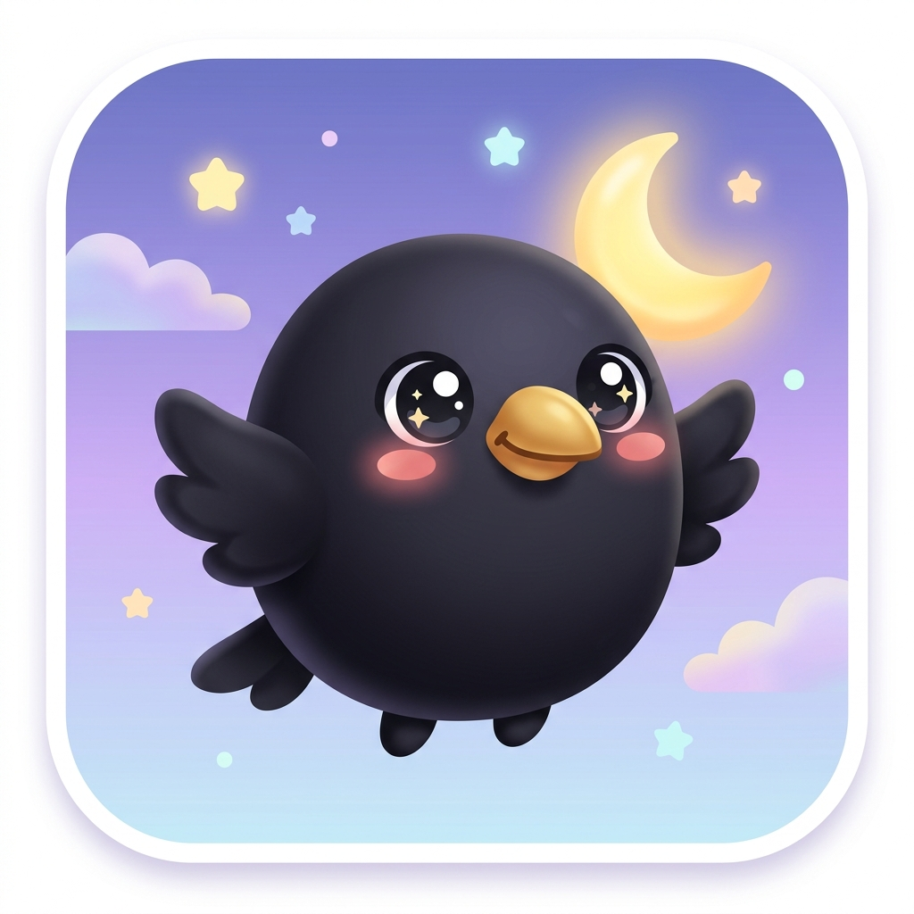
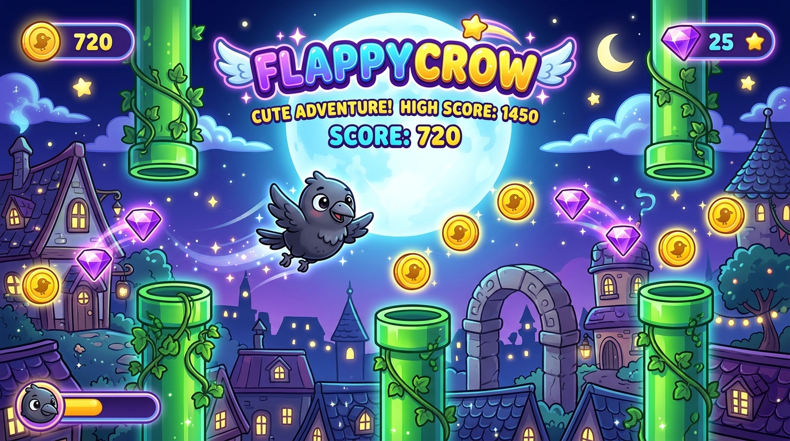

# 🐦 FlappyCrow

<p align="center">
  
</p>

<p align="center">
  <b>Kid-Friendly, Cute & Aesthetic Native Android Arcade Game</b>
</p>

<p align="center">
  
</p>

---

### 🎨 Official App Icon & Visual Identity
The **FlappyCrow** app icon features an adorable, chubby baby crow named **Coco** with big expressive anime eyes, rosy blush cheeks, and a smiling golden beak set against a soft, moonlit purple-blue starry night. Designed specifically to be cheerful, minimal, and soft on the eyes for players of all ages!

---

**FlappyCrow** is a high-fidelity, fully native Android casual arcade game built from the ground up using **Kotlin**, **Jetpack Compose**, and **Material Design 3**. Guide Coco the mischievous crow through a magical moonlit city, dodging tricky chimney pipes, collecting sparkling coins and gems, and unlocking cool accessories along the way!

---

## 🎮 Features Overview

### 1. High-Performance Canvas Game Engine
*   **Smooth Game Loop**: Implemented with precise Kotlin Coroutine state updates synchronized with the Android system clock.
*   **Custom Graphics Rendering**: Built entirely on a hardware-accelerated Compose `Canvas`, avoiding heavy external game engines or resource-intensive XML views.
*   **Parallax City Background**:
    *   **Layered Depth**: Separate scrolling layers for distant silhouette skyscrapers, slow-drifting puffy clouds, and twinkling stars.
    *   **Magical Atmosphere**: A massive glowing moon, random procedurally twinkling stars, and animated flapping bats flying in the background.

### 2. Coco's Flight Physics & Bounding-Box Collisions
*   **Realistic Flight Model**: Custom gravity acceleration, flap upward impulse forces, and tilt angles that rotate Coco dynamically based on vertical velocity.
*   **Collision Detection**: Real-time bounding box intersection checks between Coco's circular hitbox and the rectangular obstacles.
*   **Ground/Ceiling Constraints**: Keeps Coco safely within the virtual height boundary or triggers a graceful game-over state if the ground is hit.

### 3. Obstacle Spawning & Dynamic Collectibles
*   **Procedural Generation**: Scrolling chimney columns spawned with randomized gap heights and positions, increasing in frequency as the score rises.
*   **Rich Collectible Loop**:
    *   **Gold Coins**: Grants `+1 Coin` and score boosts.
    *   **Amethyst Gems**: Rare, glowing power-ups granting `+5 Coins`.
    *   **Aesthetic Particle Feedback**: Shimmering coin sparks, golden bursts, and visual ring expansion animations trigger on successful collections.

### 4. Customization Shop & Live Avatar Rendering
*   **The Customize Screen**: Spend hard-earned coins to purchase fun cosmetic accessories:
    *   🎩 *Wizard Hat* (Magical blue with stars)
    *   🕶️ *Cool Sunglasses* (Retro-futuristic red shades)
    *   🚁 *Flying Propeller* (With animated spinning blades!)
    *   🎀 *Bow Tie* (Dapper red accessory)
*   **Live Render Pipeline**: The selected accessory is dynamically layered onto Coco's avatar using custom coordinate scaling in both the Shop Preview and the active Gameplay Canvas.

### 5. Persistent Local Storage (Room Database)
*   **Seamless Persistence**: Powered by a lightweight **Room SQLite database** utilizing a clean Repository pattern and MVVM architecture.
*   **Saved State**: Tracks high scores, lifetime coins, selected accessory, and unlocked item states securely across application launches.
*   **Destructive Migration Safeguards**: Integrated automatic database version checks to avoid app crashes during upgrades.

### 6. Sound Synthesizer & Safe Vibration Settings
*   **Synthesized Feedback**: Audio system options providing responsive gameplay cues.
*   **Haptic Engine**: Android `Vibrator` integration triggers crisp physical vibrations upon collisions or collecting items.
*   **Safeguarded Permissions**: Fully wrapped to gracefully catch any device-level differences or permission restrictions.

---

## 🛠️ Technology Stack

| Technology | Purpose |
| :--- | :--- |
| **Kotlin** | Modern, concise, and type-safe primary programming language. |
| **Jetpack Compose** | Declarative modern UI and Canvas drawing framework. |
| **Kotlin Coroutines / Flow** | Asynchronous physics calculations and reactive UI state updates. |
| **Room Database** | Type-safe SQLite persistence for user statistics and shop state. |
| **Material 3 (M3)** | Dynamic visual theme, custom gradients, typography, and card layouts. |
| **Robolectric** | Fast, local JVM unit testing for Context and App Resources. |
| **Roborazzi** | Visual regression and screen-capture screenshot verification testing. |

---

## 🏛️ Architecture & Codebase Structure

The project strictly follows the **MVVM (Model-View-ViewModel)** and **Clean Architecture** patterns:

```
com.example/
│
├── MainActivity.kt               # Entry Component, Scaffold, & Navigation crossfade router
│
├── data/
│   ├── database/
│   │   ├── AppDatabase.kt        # Room DB configuration with migration fallbacks
│   │   ├── GameDao.kt            # CRUD interfaces for stats, accessories, and achievements
│   │   ├── UserStats.kt          # Table representing user stats (High Score, Coins, etc.)
│   │   ├── UnlockedAccessory.kt  # Join table representing owned shop items
│   │   └── UnlockedAchievement.kt# Unlocked badges database records
│   │
│   └── repository/
│       └── GameRepository.kt     # High-level data accessor bridging local DB cache & UI State
│
└── ui/
    ├── theme/
    │   ├── Theme.kt              # App-wide Material 3 styling, color scheme, & typography
    │   └── Color.kt              # Neon cyberpunk & moonlit sky color palette constants
    │
    └── game/
        ├── GameViewModel.kt      # Game lifecycle orchestrator (Menu -> Play -> Shop -> Game Over)
        ├── GameScreens.kt        # Main Menu, Customize, Settings, Achievements, & Game Over UI
        └── FlappyCrowGame.kt     # High-performance 2D Canvas engine, physics loop, & particles
```

---

## 🧪 Testing and Verification

FlappyCrow is fully integrated with a modern local JVM testing suite. You can run unit tests and render screenshot snapshots locally without starting an emulator:

*   **To run JVM Unit & Integration Tests**:
    ```bash
    gradle :app:testDebugUnitTest
    ```
*   **To run Roborazzi Screen Capture Checks**:
    ```bash
    gradle :app:verifyRoborazziDebug
    ```
*   **To record/update Reference Screenshots**:
    ```bash
    gradle :app:recordRoborazziDebug
    ```

---

## ✨ Design & Visual Polish

*   **Glow and Gradient Accents**: Every UI screen leverages dark purple deep-space card designs bordered by glowing magenta and neon-blue stroke gradients, creating a highly polished arcade-cabinet aesthetic.
*   **Micro-interactions**: Clean scale-up animations on button clicks, interactive sliders, dynamic toggle switch feedback, and interactive high-contrast buttons conforming to strict **48dp touch-target accessibility standards**.
